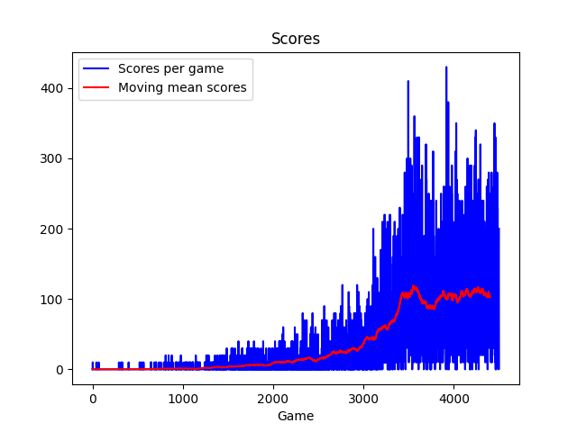
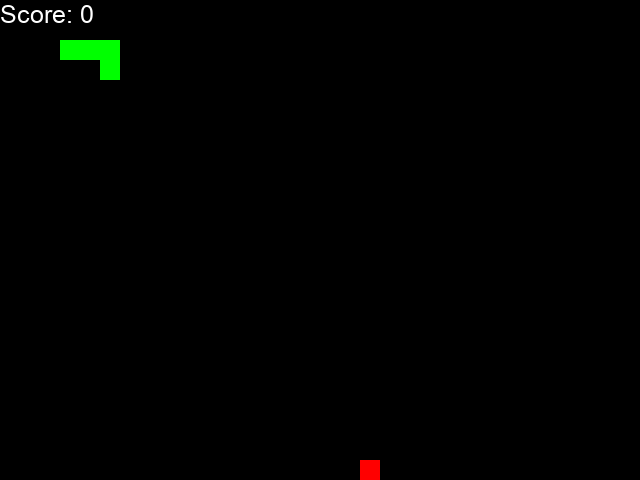

# AI snake
 An implementation of deep reinforcment learning concepts to play Snake with AI. 
 The network is a linear dqnet. The state received by the net includes the fruit position, direction of motion of the snake and position of possible obstacles (namely the snake body and the borders of the game).  
 Here is the training behaviour after 4500 matches playes

 

 And here a match played by the trained network

 
